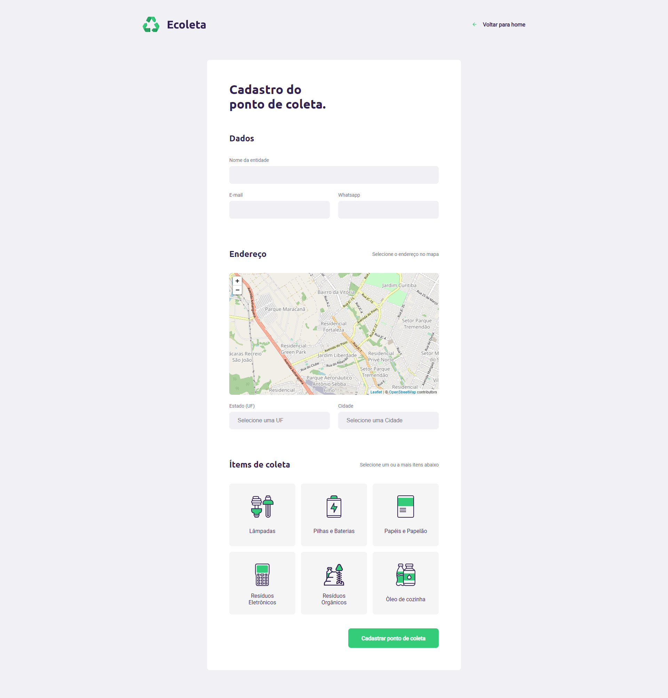

<h1 align="center">
  
</h1>



---

<h2>📮 Sobre</h2>
<p>
  O <strong>Ecoleta.</strong> é uma aplicação voltada para cadastros de pontos de
  coleta de produtos descartáveis, projeto proposto pela RocketSeat. 
</p>.

---
<h2>💻 Tecnologias utilizadas. </h2>

- [ReactJS](https://pt-br.reactjs.org/docs/getting-started.html)
- [NodeJS](https://nodejs.org/en/docs/)
- [Knex](http://knexjs.org/)

---
<h2> ✔ Como baixar o projeto.</h2>

```bash
#Clonar o repositório
$git clone https://github.com/Luan4560/web-Ecoleta.git

#Entrar no diretório
$cd web-ecoleta


#Instalar dependências 
$yarn  
$npm install
 
#Inicializar o projeto
$yarn start 
```

---

Desenvolvido pro 🤘 Luan Nascimento